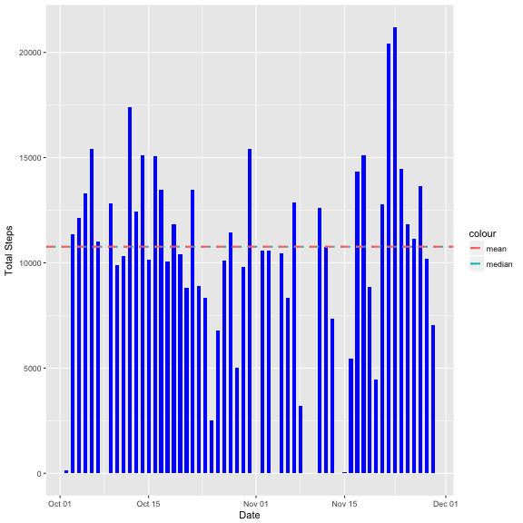
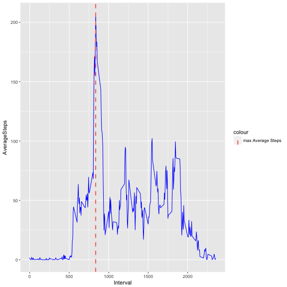
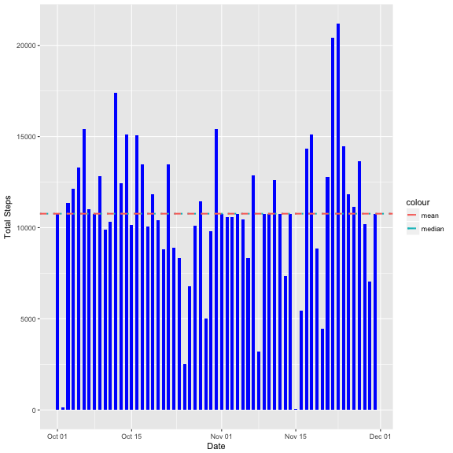
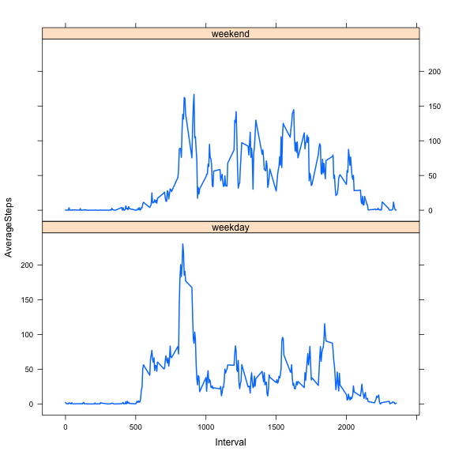

  


##Loading and preprocessing the data

1.Loading the data

```r
temp <- tempfile()
download.file("https://d396qusza40orc.cloudfront.net/repdata%2Fdata%2Factivity.zip",temp,quiet = TRUE)
DF <- read.table(unz(temp,"activity.csv"),header = TRUE,sep = ",",stringsAsFactors = FALSE)
unlink(temp)
dim(DF)
```

```
## [1] 17568     3
```

```r
str(DF)
```

```
## 'data.frame':	17568 obs. of  3 variables:
##  $ steps   : int  NA NA NA NA NA NA NA NA NA NA ...
##  $ date    : chr  "2012-10-01" "2012-10-01" "2012-10-01" "2012-10-01" ...
##  $ interval: int  0 5 10 15 20 25 30 35 40 45 ...
```
2.Processing the data

```r
DF$date <- as.Date(DF$date)
```

##What is mean total number of steps taken per day?
1.Total no of steps per day

```r
totalDF <- aggregate(DF$steps~DF$date,FUN=sum,na.rm=TRUE)
colnames(totalDF) <- c("date", "totalSteps")
```


```r
g <- ggplot(totalDF,aes(x=date,y=totalSteps))+geom_col(width = .6,fill = "blue")
y <- g +geom_hline(aes(yintercept=median(totalDF$totalSteps),colour="median"),lty=3,lwd=1,
                   show.legend = TRUE)
y+ geom_hline(aes(yintercept=mean(totalDF$totalSteps),colour="mean"),lty=2,lwd=1)+xlab("Date")+ylab("Total Steps")
```



```r
median(totalDF$totalSteps)
```

```
## [1] 10765
```

```r
mean(totalDF$totalSteps)
```

```
## [1] 10766.19
```

##What is the average daily activity pattern?

```r
DF2 <- aggregate(DF$steps~DF$interval,FUN=mean,na.rm=TRUE)
colnames(DF2) <- c("Interval", "AverageSteps")
z <- ggplot(DF2,aes(x=Interval,y=AverageSteps))+geom_line(colour ="blue")
maxAverageSteps <- max(DF2$AverageSteps)
maxStepsInterval <- DF2[,1][DF2$AverageSteps==maxAverageSteps]
z+geom_vline(aes(xintercept=maxStepsInterval,colour="max Average Steps"),lty=2,lwd=1)
```



```r
maxAverageSteps
```

```
## [1] 206.1698
```

##Imputing missing values

1.Total no of missing values  


```
## [1] 2304
```

```r
imputedData <- merge(DF,DF2,by.x = "interval",by.y = "Interval")
## Capturing index for NA values before replacement
index <- which(is.na(imputedData$steps))
index <- as.numeric(index)
## Replacing missing values with mean values of 5 minute interval
imputedData$steps[index] <- imputedData$AverageSteps[index]
completeData <- select(imputedData,steps,date,interval)
```

```r
totalDF2 <- aggregate(completeData$steps~completeData$date,FUN=sum)
colnames(totalDF2) <- c("date", "totalSteps")
```


```r
w <- ggplot(totalDF2,aes(x=date,y=totalSteps))+geom_col(width = .6,fill = "blue")
h <- w +geom_hline(aes(yintercept=median(totalDF2$totalSteps),colour="median"),lty=3,lwd=1,
                   show.legend = TRUE)
h+ geom_hline(aes(yintercept=mean(totalDF2$totalSteps),colour="mean"),lty=2,lwd=1)+xlab("Date")+ylab("Total Steps")
```



```r
median(totalDF2$totalSteps)
```

```
## [1] 10766.19
```

```r
mean(totalDF2$totalSteps)
```

```
## [1] 10766.19
```
Do these values differ from the estimates from the first part of the assignment? No, it is almost same.What is the impact of imputing missing data on the estimates of the total daily number of steps? No major impact as only 13.11% of data was missing values.    

##Are there differences in activity patterns between weekdays and weekends?


```r
weekday <- c("Monday","Tuesday","Wednesday","Thursday","Friday")
completeData$Day <- factor((weekdays(completeData$date) %in% weekday),levels = c(TRUE,FALSE),labels = c("weekday","weekend"))
```


```r
plotData <- aggregate(completeData$steps~completeData$interval+completeData$Day,FUN=mean)
colnames(plotData) <- c("Interval","Day","AverageSteps")
xyplot(AverageSteps~Interval|Day,data = plotData,type="l",layout=c(1,2),lwd=2)
```



During weekends the persons starts activity bit late which can be compared from spike at 500 interval during weekday.
